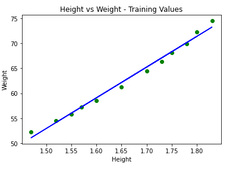
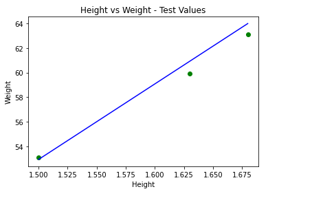

# A Machine Learning Model to Predict Weights From A Given Set of Heights

#### **Summary of the task:**

 The repository contains python code used to train and build a machine learning model using simple linear regression. A small dataset was used consisting of two columns (height and weight). The data was first split into the training set and the test set; tools from the Scikit Learn Library were then used to build the main model.

*This is a highly recommended practice exercise for programmers new to the world of machine learning.* 

#### **Analysis of Results:**

  

 
 
Two graphs are shown above, one display the regression line with values from the training dataset and one with values from the test dataset. The green points of the scatter plot (for the test graph) represent the real values of height stored in the test dataset. The regression line (blue) represents the set of predicted values of height. Since all the points either lie on the line or lie very close to it, it can be said that choosing simple linear regression to make the model was a good decision. 

#### **Conclusion:** 

<em> There is a strong linear correlation between the heights and weights of the dataset in the form y=mx+c. </em> 

A model with high accuracy for predicting weights has been produced. 

